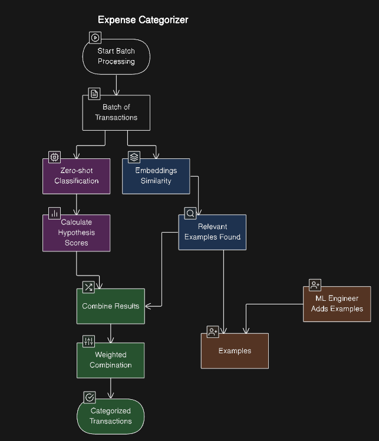
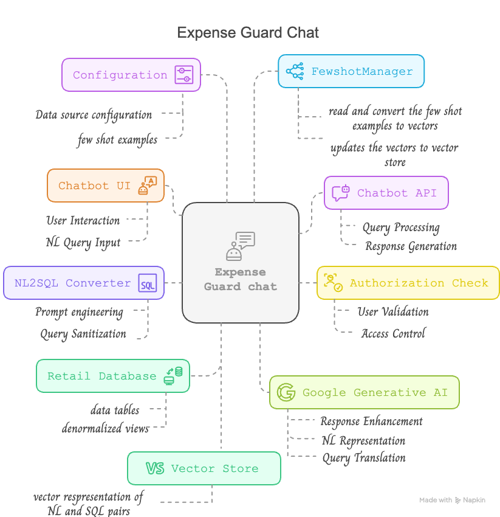

# expense-guard

## Business case
Money making is a skill, and money management is a discipline. Earning money requires creativity, strategy, and effort, but keeping and growing that money requires careful planning, control, and informed decision-making. Whether you're managing personal finances or running a business, knowing where your money goes is essential. However, tracking expenses, categorizing transactions, and analyzing spending patterns manually can be overwhelming. With 'ExpenseGuard', you can turn financial management into a simple and efficient process.

### Automatic Expense Categorization
Imagine if your expenses could be automatically sorted into categories like Groceries, Travel, Rent, Utilities, Entertainment, or Office Supplies just by analyzing the transaction description. With smart AI, this is now possible.

For example:

A bank statement shows "IRASITXSjhdddA $700" → The system detects this as "Tax" A business expense shows "Grab Ride $15" → The system detects this as "Transport" By using AI to recognize brands, keywords, and patterns, your expenses are neatly organized without manual work. This allows you to focus on making better financial decisions rather than spending time tracking expenses.

### Ask Questions 
Once your expenses are categorized, you don’t need complex reports or spreadsheets to understand your spending. You can simply ask questions like:

"What was our travel budget last quarter?" "Are we overspending on utilities?" "Which category should we reduce spending on?"

## Setup - How to run locally
cd expense-guard

docker-compose up --build -d (the build is for the first time and when you change the code or config)

docker-compose down (tear down)

docker-compose up -d (this will bring up the containers run it in background)

## System components 

Two critical components are 
 - Expense Categorizer 
 - Expense Chat 

### Expense Categorizer

 
### Expense chat 

### Models - Generative API - used

|Feature | ML Models|
|--------|----------|
|Expense Categorization|Zero-shot: MoritzLaurer/DeBERTa-v3-base-mnli-fever-anli   Embeddings: sentence-transformers/all-MiniLM-L6-v2|
|Expense chat | sentence-transformers/all-MiniLM-L6-v2   gemini-2.0-flash|

### Demo

[Watch the demo video](documentation/expense_insights.mp4)